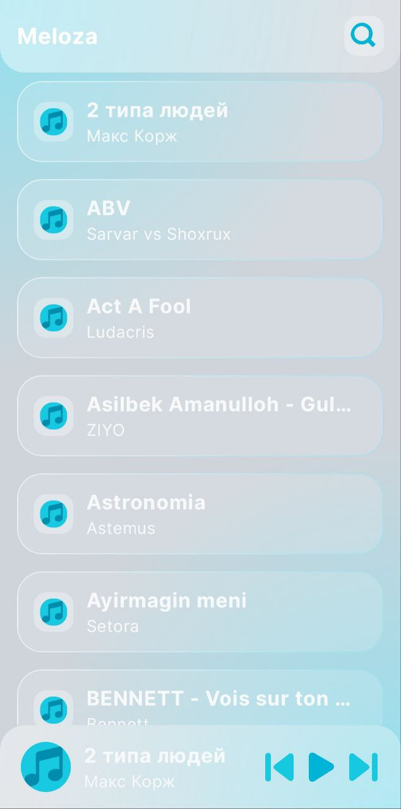
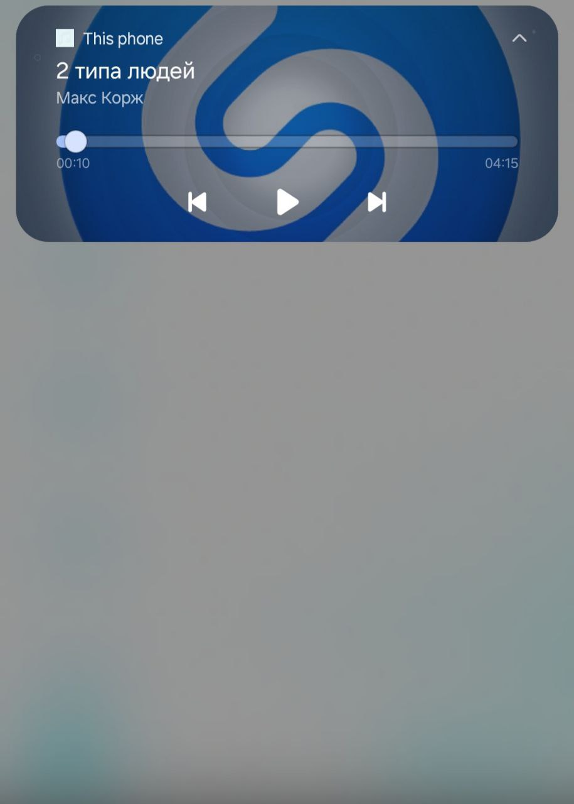
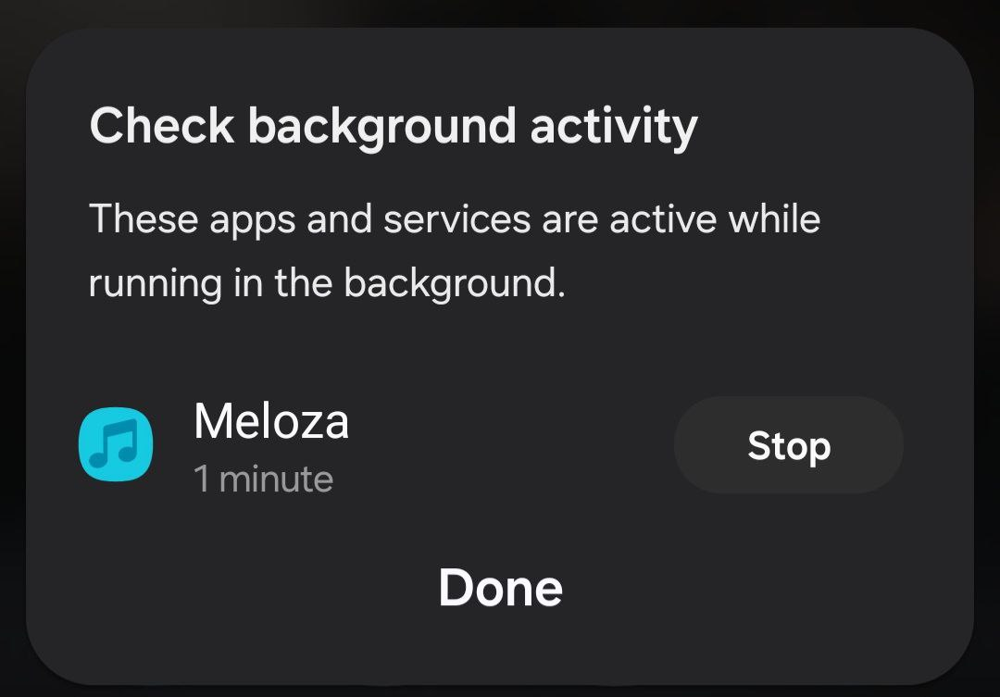

# Meloza 🎵

**Meloza** is an Android music player application that reads and plays audio files from the device storage.  
The app supports background playback and continues playing music even when the application is closed.

## Features
- Play music from device local storage
- Background audio playback
- Foreground service for uninterrupted playback
- Media controls via notification

## Architecture
- MVI (Model–View–Intent)
- Orbit MVI
- Single source of truth for UI state

## Tech Stack
- **Language:** Kotlin  
- **UI:** Jetpack Compose  
- **Architecture:** MVI, Orbit MVI  
- **DI:** Dagger Hilt  
- **Media:** Android Media Player / Media3  
- **Networking:** Retrofit  
- **Navigation:** Voyager  
- **Image Loading:** Coil Compose  
- **Services:** Foreground Service  
- **Notifications:** Media style notifications  
- **Monitoring:** Firebase Crashlytics  

## App Behavior
- Music continues playing when the app is in the background or closed
- Playback is managed via foreground service for reliability

## Project Status
Demo / learning project

## APK
Download apk from the `apk/` directory and test the application.

## Screenshots

  
  
  
  

